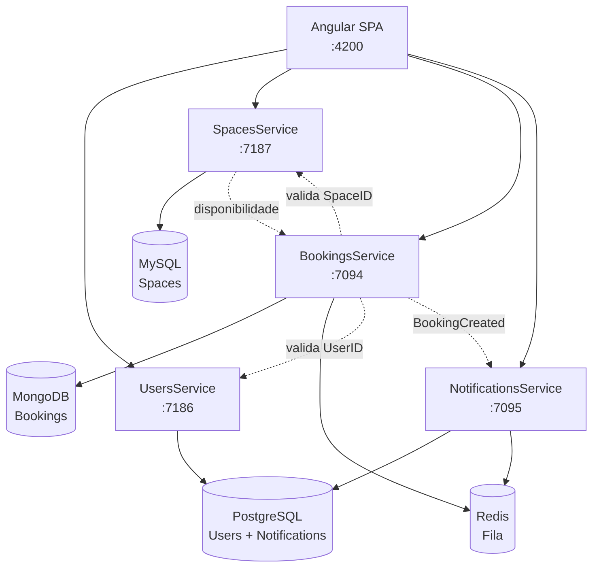

# Plataforma de Reservas

Microsserviços para reserva de espaços (coworking, salas, quartos) com validação de usuário/espaço, controle de conflito de datas e notificações assíncronas via Redis.

## Arquitetura



### Camadas por serviço

Cada API segue o padrão **API → BLL → DAL**:

| Serviço | Banco | Responsabilidade |
|---------|-------|------------------|
| **UsersService** | PostgreSQL (`ReservasUsers`) | Cadastro, login JWT, perfil de usuário |
| **SpacesService** | MySQL (`spaces_db`) | CRUD de espaços e consulta de disponibilidade |
| **BookingsService** | MongoDB (`ReservasBookings`) + Redis | Reservas, validação HTTP com Users/Spaces, publicação de eventos |
| **NotificationsService** | PostgreSQL (`ReservasNotifications`) + Redis | Consumo da fila `booking-events` e histórico de notificações |

### Fluxo de criação de reserva

1. Cliente autenticado chama `POST /api/bookings` no **BookingsService**.
2. BookingsService valida `userId` e `spaceId` via HTTP nos serviços Users e Spaces.
3. Verifica conflito de datas no MongoDB.
4. Persiste a reserva e publica evento `BookingCreated` na fila Redis `booking-events`.
5. **NotificationsService** consome o evento, grava a notificação no PostgreSQL e disponibiliza via API.

---

## Executar com Docker Compose

### Pré-requisitos

- [Docker Desktop](https://www.docker.com/products/docker-desktop/) (ou Docker Engine + Compose v2)

### Subir tudo

Na pasta `Reservas`:

```bash
docker compose up --build
```

Para rodar em segundo plano:

```bash
docker compose up --build -d
```

### Subir apenas a infraestrutura

Útil quando você desenvolve as APIs localmente com `dotnet run`:

```bash
docker compose up -d postgres mysql mongodb redis
```

O serviço `postgres-init` cria automaticamente os bancos `ReservasUsers` e `ReservasNotifications` na primeira execução.

### Parar e remover volumes

```bash
docker compose down
```

Para apagar dados persistidos (bancos, filas):

```bash
docker compose down -v
```

### URLs no Docker

| Recurso | URL |
|---------|-----|
| Users Swagger | http://localhost:7186/swagger |
| Spaces Swagger | http://localhost:7187/swagger |
| Bookings Swagger | http://localhost:7094/swagger |
| Notifications Swagger | http://localhost:7095/swagger |

### Variáveis de ambiente (Docker)

As variáveis abaixo espelham os `appsettings.json` de cada serviço:

| Serviço | Variáveis principais |
|---------|---------------------|
| **users-service** | `ConnectionStrings__PostgresConnection`, `Jwt__*` |
| **spaces-service** | `MYSQL_HOST`, `MYSQL_PASSWORD`, `BookingsServiceUrl` |
| **bookings-service** | `ConnectionStrings__MongoConnection`, `ConnectionStrings__Redis`, `MongoDb__DatabaseName`, `UsersServiceUrl`, `SpacesServiceUrl`, `Jwt__*` |
| **notifications-service** | `ConnectionStrings__PostgresConnection`, `Redis__ConnectionString`, `Jwt__*` |

Credenciais padrão dos bancos no compose:

| Banco | Host (Docker) | Porta | Database | Usuário | Senha |
|-------|---------------|-------|----------|---------|-------|
| PostgreSQL | `postgres` | 5432 | `ReservasUsers` / `ReservasNotifications` | `postgres` | `postgres` |
| MySQL | `mysql` | 3306 | `spaces_db` | `root` | `admin` |
| MongoDB | `mongodb` | 27017 | `ReservasBookings` | — | — |
| Redis | `redis` | 6379 | — | — | — |

---

## Executar localmente (dotnet + npm)

### Pré-requisitos

- [.NET 8 SDK](https://dotnet.microsoft.com/download)
- [Node.js 20+](https://nodejs.org/) e npm
- Bancos rodando (via Docker Compose ou instalação local)

### 1. Infraestrutura

```bash
cd Reservas
docker compose up -d postgres mysql mongodb redis
```

### 2. APIs (.NET)

Cada serviço possui sua própria solution. Em terminais separados:

```bash
# Users — https://localhost:7186
cd UsersService/UsersService.Api
dotnet run --launch-profile https

# Spaces — https://localhost:7187
cd SpacesService/SpacesService.Api
dotnet run --launch-profile https

# Bookings — https://localhost:7094
cd BookingsService/BookingsService.Api
dotnet run --launch-profile https

# Notifications — https://localhost:7095
cd NotificationsService/NotificationsService.Api
dotnet run --launch-profile https
```

Os `appsettings.json` já apontam para `localhost` com as portas padrão dos bancos e URLs HTTPS entre serviços.

**SpacesService** resolve a connection string MySQL substituindo `$MYSQL_HOST` e `$MYSQL_PASSWORD`. Localmente, os defaults são `localhost` e `admin`. Para outra senha:

```bash
# PowerShell
$env:MYSQL_PASSWORD = "admin"
dotnet run --launch-profile https
```

### 3. Frontend (Angular)

```bash
cd frontend
npm install
npm start
```

A aplicação sobe em **http://localhost:4200**. Ajuste `frontend/src/environment.ts` se necessário para apontar às URLs dos microsserviços.

### Connection strings locais (referência)

Valores em `appsettings.json`:

```
Users / Notifications (PostgreSQL):
  Host=localhost;Port=5432;Database=ReservasUsers|ReservasNotifications;Username=postgres;Password=postgres

Spaces (MySQL):
  Server=localhost;Port=3306;Database=spaces_db;User=root;Password=admin

Bookings (MongoDB + Redis):
  mongodb://localhost:27017
  localhost:6379
  Database: ReservasBookings
```

---

## Portas e endpoints

### Portas

| Componente | Porta HTTP (local) | Porta HTTPS (local) | Porta Docker |
|------------|-------------------|---------------------|--------------|
| Angular | 4200 | — | — |
| UsersService | 5186 | **7186** | 7186 |
| SpacesService | 5117 | **7187** | 7187 |
| BookingsService | 5094 | **7094** | 7094 |
| NotificationsService | 5095 | **7095** | 7095 |
| PostgreSQL | — | — | 5432 |
| MySQL | — | — | 3306 |
| MongoDB | — | — | 27017 |
| Redis | — | — | 6379 |

### Endpoints

#### UsersService — `:7186`

| Método | Endpoint | Auth | Descrição |
|--------|----------|------|-----------|
| `POST` | `/api/Auth/register` | Não | Cadastro de usuário |
| `POST` | `/api/Auth/login` | Não | Login (retorna JWT) |
| `GET` | `/api/Users/{id}` | Não | Buscar perfil por ID |

#### SpacesService — `:7187`

| Método | Endpoint | Descrição |
|--------|----------|-----------|
| `GET` | `/api/spaces` | Listar espaços |
| `GET` | `/api/spaces/{id}` | Buscar espaço por ID |
| `GET` | `/api/spaces/search/{termo}` | Buscar por nome ou localização |
| `GET` | `/api/spaces/{id}/availability?from={date}&to={date}` | Verificar disponibilidade |
| `POST` | `/api/spaces` | Criar espaço |
| `PUT` | `/api/spaces/{id}` | Atualizar espaço |
| `DELETE` | `/api/spaces/{id}` | Remover espaço |

#### BookingsService — `:7094`

| Método | Endpoint | Auth | Descrição |
|--------|----------|------|-----------|
| `GET` | `/api/bookings` | Não | Listar reservas |
| `GET` | `/api/bookings/{id}` | Não | Buscar reserva por ID |
| `GET` | `/api/bookings/search/userid/{userId}` | Não | Reservas por usuário |
| `GET` | `/api/bookings/search/spaceid/{spaceId}` | Não | Reservas por espaço |
| `GET` | `/api/bookings/search/date/{date}` | Não | Reservas por data |
| `POST` | `/api/bookings` | Sim | Criar reserva |
| `PUT` | `/api/bookings/{id}` | Sim | Atualizar reserva |
| `DELETE` | `/api/bookings/{id}` | Sim | Cancelar reserva |

#### NotificationsService — `:7095`

| Método | Endpoint | Auth | Descrição |
|--------|----------|------|-----------|
| `POST` | `/api/notifications/send` | Sim | Enviar notificação (interno) |
| `GET` | `/api/notifications/userid/{userId}` | Sim | Histórico de notificações do usuário |

Swagger UI disponível em `/swagger` em cada API (ambiente Development).

---

## Seed e usuário Admin

**Não há seed automático de usuário admin.** Na inicialização:

- **UsersService** e **NotificationsService** criam apenas o schema das tabelas (`users`, `notifications`).
- **SpacesService** executa `EnsureCreated()` no MySQL (schema vazio).
- **BookingsService** usa MongoDB sem seed inicial.

Registros via `POST /api/Auth/register` recebem sempre a role **`Customer`**.

Para criar um admin manualmente, após registrar um usuário, atualize o banco PostgreSQL:

```sql
-- Conectar em ReservasUsers
UPDATE users SET role = 'Admin' WHERE email = 'seu@email.com';
```

Roles disponíveis: `Customer`, `Admin`. Usuários com role `Admin` podem consultar notificações de qualquer usuário no NotificationsService.

### JWT compartilhado

Todos os serviços autenticados usam a mesma configuração JWT (definida no UsersService):

| Setting | Valor |
|---------|-------|
| Issuer | `ReservasUsersService` |
| Audience | `ReservasPlatform` |
| SecretKey | `ReservasUsersService_SuperSecretKey_Min32Chars!` |

Obtenha um token com `POST /api/Auth/login` e envie no header `Authorization: Bearer {token}`.

---

## Estrutura do repositório

```
Reservas/
├── docker-compose.yml
├── README.md
├── frontend/                 # Angular SPA
├── UsersService/             # API + BLL + DAL
├── SpacesService/
├── BookingsService/
└── NotificationsService/
```
